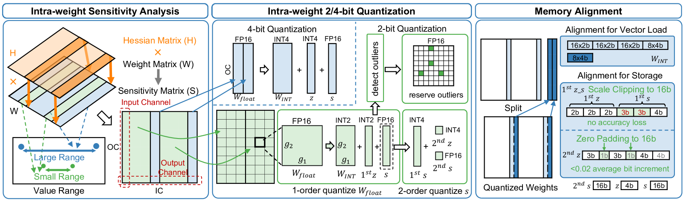
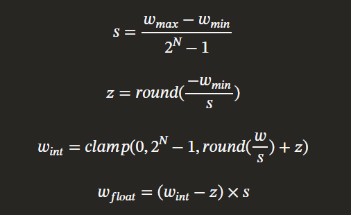

## Memboost: Cuda 2-bit Inference Engine for LLMs

Goal of this project: Take weights in fp16/fp32 and convert them to int2 (using CUDA)

Algo: Intra-matrix mixed-precision quantization based on: "Fast and Efficient 2-bit LLM Inference on GPU" (arxiv 2311.16442)






### Run
```bash
~$ nvcc -DTEST_QUANTIZE -o test_quantize core/quantize.cu -lcusparse
~$ ./test_quantize
```